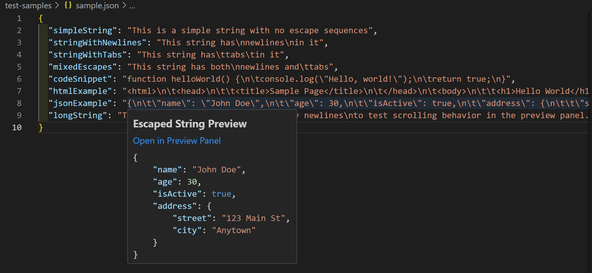

# Escape Buster

Escape Buster is a VS Code extension that provides a convenient way to preview strings containing escape sequences like `\n`, `\t`, and `\r`. It's especially useful when working with code or formatted data stored as strings in JSON files, source code, and other formats.

## Features

- **Preview on Hover**: Instantly see the expanded content of strings with escape sequences when hovering over them
- **Dedicated Preview Panel**: Open strings in a full preview panel for better viewing and interaction
- **Syntax Highlighting**: Automatic language detection and syntax highlighting for code snippets
- **Theme Compatibility**: Consistent syntax highlighting in both light and dark themes
- **Copy to Clipboard**: Easily copy the expanded content with a single click



## Installation

1. Open VS Code
2. Go to Extensions (Ctrl+Shift+X / Cmd+Shift+X)
3. Search for "Escape Buster"
4. Click Install

## Usage

1. Open a file containing strings with escape sequences (e.g., a JSON file)
2. Hover over a string that contains escape sequences like `\n`, `\t`, or `\r`
3. A preview will appear showing the formatted content with escape sequences interpreted
4. Click "Open in Preview Panel" to open a larger, dedicated view
5. Use the "Copy to Clipboard" button to copy the expanded content

### Supported Escape Sequences

- `\n` - New line
- `\t` - Tab
- `\r` - Carriage return
- `\"` - Double quote
- `\'` - Single quote
- `\/` - Forward slash
- `\\` - Backslash

## Configuration

EscapeBuster can be configured through the VS Code settings:

- `escapeBuster.enabledFileTypes`: Array of file extensions where the extension should be active (default: `["json"]`)
- `escapeBuster.hoverDelay`: Delay in milliseconds before showing the preview (default: `300`)
- `escapeBuster.enableAutoPreview`: Enable/disable automatic preview on hover (default: `true`)
- `escapeBuster.defaultPreviewHeight`: Default height for the preview panel (default: `300`)

Example configuration in `settings.json`:

```json
{
  "escapeBuster.enabledFileTypes": ["json", "js"],
  "escapeBuster.hoverDelay": 100,
  "escapeBuster.enableAutoPreview": true,
  "escapeBuster.defaultPreviewHeight": 100
}
```

## Requirements

- VS Code 1.75.0 or higher

## Known Issues

- Performance may be affected when previewing very large strings
- Code language detection may not be 100% accurate for all content types
- Some language-specific syntax features may not be perfectly highlighted in the preview panel

## Release Notes

### 1.0.0

Initial release of Escape Buster:

- Preview strings with escape sequences on hover
- Dedicated preview panel with "Copy to Clipboard" functionality
- Code detection and syntax highlighting for multiple languages

### 1.0.1

- Add supportng for escaped-slash `\/`

## Contributing

Contributions are welcome! Please feel free to submit a Pull Request.

## License

This extension is licensed under the [MIT License](LICENSE).
